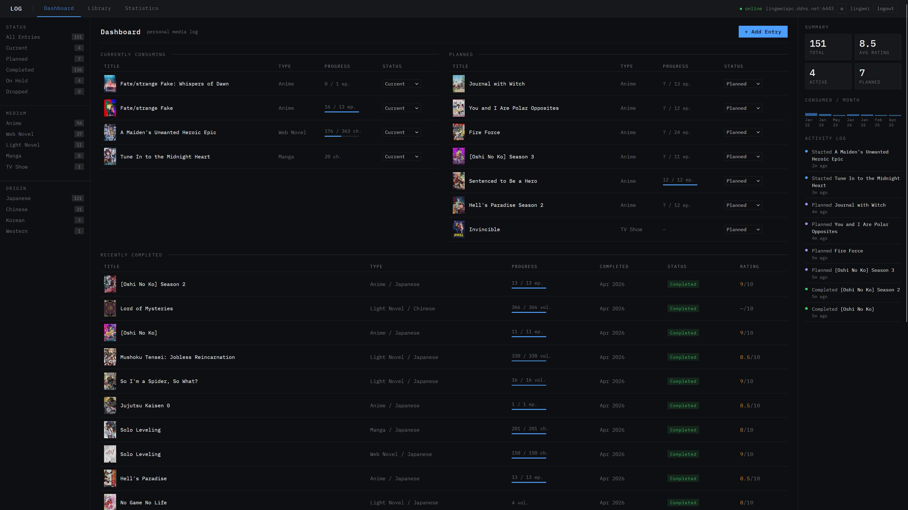
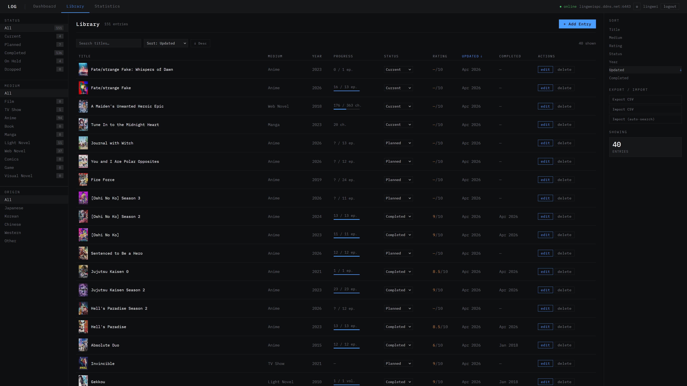
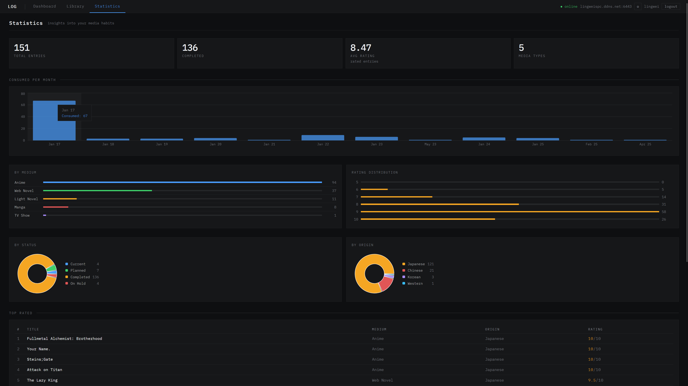

# LOGARIUM — Media Tracker

## 1. Project Overview & Features

**LOG** is a web application for tracking all types of media you consume — films, TV shows, anime, games, books, manga, light novels, web novels, and comics. Inspired by Letterboxd, MyAnimeList, Goodreads, and Backloggd, LOG unifies all your media tracking in one place.

**Public Demo:**
- Deployed and available for public use: [https://logarium.vercel.app](https://logarium.vercel.app)
- Anyone can register an account and start using the app immediately.
- Demo user available using:
    - username: demo_user
    - password: password1
- demo_user is refreshed every 24 hours by copying my personal library into demo_user. All previous changes will be wiped as this is a one-way force replace. Feel free to play aroun with demo_user.





---

**TODO**
- **Optional:**
- Add 'author' field for entry table, possibly split entry table into 2: entry + media to reduce redudancy.
- ~~Either self cache thumbnails or fetch small thumbnails for media covers for main library thumbnail display (optional, thumbnail loading is actually that slow).~~ Update: caching won't work as backend is running on an older computer over Wi-Fi connection.
- Add refresh button: use external_url to refresh details of select or all entries. Will be difficult as need to resolve conflicting changes if user made manual edits.
- Enable search by URL for supported sources.
- Possibly write a script for auto-scraping details from URL for unsupported sites. Will be very difficult due to different site structure/html. Additionally could build companion extension to allow scraping of websites without APIs.
- **Doable:**
- Add settings page for various settings: e.g. default search on library page, default source selection when searching for new entries + currently implemented settings (change password and wipe data).
- Add "Explore" page, fetching recent media from all sources, have some simple searching/filtering functionality (basically expand "add entry" modal to full pagge).
    
**Scalability:**
- Built with FastAPI and PostgreSQL, LOG is easily scalable to thousands (and potentially millions) of users, depending on your hosting resources.

**Key Features:**
- **Unified Media Tracking:** Track every medium in one place: films, TV, anime, games, books, manga, light novels, web novels, comics.
- **Powerful Filtering & Sorting:** Filter and sort by status, medium, origin, year, rating, and more.
- **Rich Statistics:** Visualize your media habits with charts and breakdowns by medium, origin, status, and time.
- **Auto Metadata Search:** Instantly search TMDB, AniList, IGDB, and Google Books to auto-fill entry details.
- **Manual & Bulk Entry:** Add entries manually or import/export your entire library as JSON or CSV.
- **Modern UI:** Responsive, clean interface with dark/light mode (coming soon).
- **Multi-User:** Designed for multiple users; simply register an account to get started.

**Pages & UI:**
- **Dashboard:** Overview, "Currently Consuming", "Recently Completed", stats, and activity log.
- **Library:** Full sortable/filterable table, CSV export, pagination, and quick status updates.
- **Statistics:** Rich charts (bar, pie, rating distribution, streaks, etc.) powered by Recharts.
- **Settings:** (Planned) Dark/light mode, import/export tools.

**Why This Project?**
- Unify all media tracking in one place, with full control and privacy.
- Showcase modern full-stack development skills (React, FastAPI, PostgreSQL, SQLAlchemy, Vite, Recharts).
- Demonstrate best practices: clean architecture, typed APIs, pure service layers, and modern UI/UX.

---

## 2. Technical Details & Local Development

### Tech Stack

| Layer     | Technology                                      |
|-----------|-------------------------------------------------|
| Frontend  | React 18, Vite, plain CSS (no Tailwind/CSS-in-JS) |
| Backend   | Python 3.11+, FastAPI                           |
| Database  | PostgreSQL 14+, SQLAlchemy 2 ORM, Alembic       |
| Charts    | Recharts                                        |
| HTTP      | httpx (backend outbound), native fetch (frontend) |

- **Frontend:** Runs on port 3000 (`npm start` via Vite)
- **Backend:** Runs on port 6443 (`python main.py` via uvicorn)

### Project Structure

```
MediaTrack2.0/
├── frontend/                  # React + Vite application
│   ├── index.html
│   ├── index.jsx
│   ├── app.jsx
│   ├── styles.css
│   ├── api.jsx
│   ├── utils.jsx
│   ├── design.css
│   ├── vite.config.js
│   ├── package.json
│   ├── pages/
│   │   ├── Dashboard.jsx
│   │   ├── Library.jsx
│   │   ├── Statistics.jsx
│   │   └── components/
│   │       ├── AddEntryModal.jsx
│   │       ├── EditEntryModal.jsx
│   │       └── ...
└── backend/                   # FastAPI application
    ├── main.py
    ├── requirements.txt
    ├── alembic/
    ├── models.py
    ├── routers.py
    ├── schemas.py
    ├── services/
    └── ...
```

### Data Model

Every tracked item is an **Entry**. Main fields include:

- `id` (int): Primary key
- `title` (string): Required, 1–500 chars
- `medium` (string): Film, TV Show, Anime, Book, Manga, Light Novel, Web Novel, Comics, Game
- `origin` (string): Japanese, Korean, Chinese, Western, Other
- `year` (int): Release year
- `status` (string): current, planned, completed, on_hold, dropped
- `rating` (float): 0–10
- `progress` (int): Current episode/page
- `total` (int): Total episodes/pages
- `cover_url` (string): Cover image URL
- `notes` (text): Free-text notes
- `external_id` (string): ID from external API
- `source` (string): Which API the metadata came from
- `created_at`, `updated_at`, `completed_at` (datetime): Timestamps

### API Overview

All API endpoints are documented and strictly typed. The backend exposes endpoints for:

- Health check (`GET /`)
- CRUD for entries (`/entries`)
- Search external APIs (`/search`)
- Aggregated statistics (`/stats`)
- (Planned) Full library export (`/entries/export`)
- (Planned) Cover image proxy (`/proxy/image`)

### Running Locally

1. **Clone the repo:**
    ```sh
    git clone https://github.com/yourusername/MediaTrack2.0.git
    cd MediaTrack2.0
    ```
2. **Backend setup:**
    - Create a `.env` file in `backend/` (see `context.md` for example).
    - Install Python dependencies:
        ```sh
        cd backend
        pip install -r requirements.txt
        ```
    - Run database migrations:
        ```sh
        alembic upgrade head
        ```
    - Start the backend:
        ```sh
        python main.py
        ```
3. **Frontend setup:**
    - Install dependencies:
        ```sh
        cd frontend
        npm install
        ```
    - Start the frontend:
        ```sh
        npm start
        ```
4. **Open in browser:**
    - Frontend: [http://localhost:3000](http://localhost:3000)
    - Backend: [http://localhost:6443](http://localhost:6443)

---

## License

This project is for personal use and portfolio demonstration. For other uses, please contact the author.
